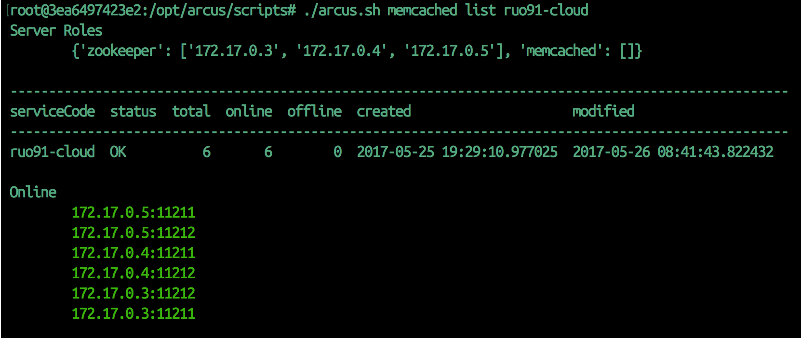
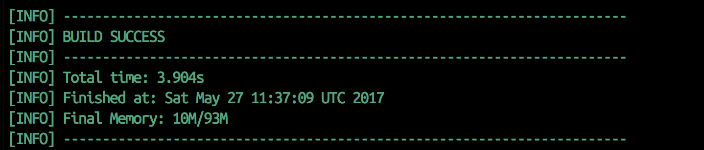

# cs494_project

진행 상황
1. Docker Container에 Arcus, Arcus-Memcached를 띄웠다. [Admin, memcached-1, memcached-2, memcached-3]
  docker에서 ruo91/arcus image를 이용해서 4개의 컨테이너를 구축한다.
  
  arcus-admin:/opt/arcus/scripts 에서
  ```
  ./build.sh
  ```
  그리고 conf/ruo91.json과 arcus.sh을 나머지 memcached 서버에 맞게 설정한다.
  그리고 나서 아래의 코드를 순차적으로 실행한다.
  ```
  ./arcus.sh deploy conf/ruo91.json
  ./arcus.sh zookeeper init
  ./arcus.sh zookeeper start
  ./arcus.sh memcached register conf/ruo91.json
  ./arcus.sh memcached start (your service code)
  ```
  제대로 작동하는지 확인하려면,
  ```
  ./arcus.sh memcached listall
  ./arcus.sh memcached list (your_service_code)
  ```
  를 실행한다.
  
  
2. Arcus Java Client에서 maven을 이용한 테스트에 통과하였다.
  같은 ruo91/arcus image에서 시작하였다.
  추가로 maven을 설치하였다.
  ```
  apt update
  apt install maven vim -y
  ```
  그리고 arcus java client 설명서를 따라했다.
  설명을 따라할 때, pom.xml의 끝에 아래 코드를 추가했다.
  ```
  <build>
        <plugins>
                <plugin>
                        <groupId>org.apache.maven.plugins</groupId>
                        <artifactId>maven-compiler-plugin</artifactId>
                        <version>3.0</version>
                        <configuration>
                                <source>1.5</source>
                                <target>1.5</target>
                        </configuration>
                </plugin>
        </plugins>
  </build>
  ```
  그리고, helloarcustest.java에서 ip 주소는 arcus-admin이 아닌 arcus-memcached 주소를 등록하니 잘 돌아갔다.
  
  docker: you can figure it out with the id following the "root"
  
3. I made 3 tables in my mysql server, 'Profile', 'Relationship' and 'Thoughts'(writings). These would be used to test the differences between mysql-only and arcus used services. This test will query the 10 latest writings of my friends. The query statement looks like below. It will take quite a long time, which would make a dramatic difference when using a cache. Also, it fits to current db usage of social network services.
```
select * from thoughts where writer in
  (select account2 from relationship where account1=
    (select account_num from profile where account='sr')
  and follows='true')
order by time desc limit 10
```
4. I connected my server to mysql successfully, and got the responsce for my query.


The index.jsp is my sourecode for tomcat server. It is used to query to mysql(which is successful) and try to connect to arcus. The arcus codes are currently copied from "arcus-java-client test".


https://github.com/naver/arcus-java-client/blob/master/docs/arcus-java-client-getting-started.md


다음 할 일
1. arcus와 연결이 가능하도록 한다.
2. nGrinder를 웹서버와 연결해서 stress test를 진행한다.
3. mySql만 사용한 경우와, arcus까지 사용한 경우를 비교한다.
4. 비슷한 방식으로 nbase-arc를 사용한 경우와도 비교한다.

*Arcus will not respond to my tomcat server. I tried to resolve this for several weeks.(Contacting arcus maintainer or restarting the project from the start) However, None worked.*

--------------------------------------------------------------------------
Contributions while building project

https://github.com/naver/ngrinder/wiki/_history
-The codes were out of the code section of markdown.
I corrected the code sections so the readers can read the wiki comfortably-

https://github.com/naver/nbase-arc/graphs/contributors
-Corrected typos in the readme

nGrinder wiki: markdown syntax corrected
